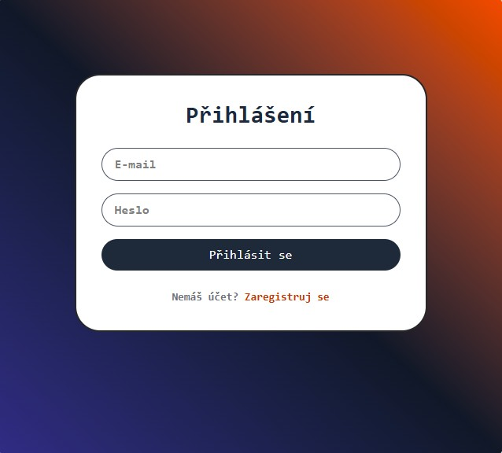
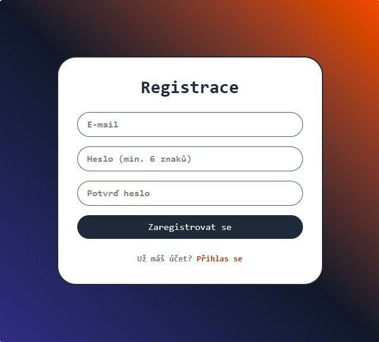
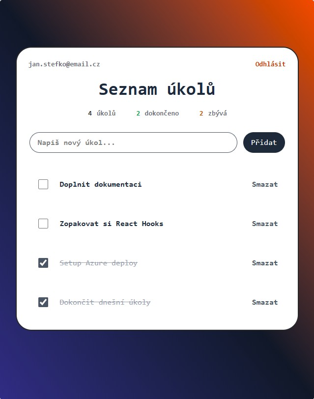

# TODO App – Frontend

React frontend pro plnohodnotnou TODO aplikaci s autentizací uživatelů. Komunikuje s [TODOApp.Backend](https://github.com/JanStefko/TODOApp.Backend) (ASP.NET Core 8 Web API) přes JWT.

🌐 **Live demo:** [todo.janstefko.cz](https://todo.janstefko.cz)

> ⏱️ První návštěva po nečinnosti může trvat 30-60 sekund – backend běží na Azure free tieru s auto-pause databází a cold-start App Service.

---

## 📸 Screenshots

| Přihlášení | Registrace |
|---|---|
|  |  |

| Seznam úkolů |
|---|
|  |

---

## ✨ Funkce

- **Registrace a přihlášení** uživatelů přes JWT
- **CRUD operace** nad úkoly (vytvoření, označení dokončeného, mazání)
- **Izolace dat** – každý uživatel vidí jen své úkoly
- **Persistence přihlášení** přes localStorage (přežije F5)
- **Auto-redirect** na login při expiraci tokenu
- **Protected routes** – nepřihlášený uživatel se nedostane k úkolům
- **Responsivní UI** – funguje na desktopu i mobilu

---

## 🛠️ Tech stack

- **React 19** – knihovna pro UI
- **Vite 8** – build tool a dev server
- **React Router 7** – client-side routing
- **Tailwind CSS 4** – utility-first styling
- **Fetch API** – komunikace s backendem (vlastní wrapper s JWT auto-injekcí)
- **localStorage** – perzistence tokenu
- **Context API** – sdílení auth stavu napříč aplikací

---

## 🏗️ Architektura

```text
src/
├── api/
│   └── apiFetch.js          # Fetch wrapper s automatickým Authorization headerem
├── context/
│   └── AuthContext.jsx      # Globální auth state (token, login, logout)
├── components/
│   ├── Header.jsx
│   ├── ProtectedRoute.jsx   # Hlídá přístup k chráněným stránkám
│   ├── TodoForm.jsx
│   ├── TodoItem.jsx
│   └── TodoList.jsx
├── pages/
│   ├── Login.jsx
│   ├── Register.jsx
│   └── Todos.jsx
├── App.jsx                  # Routing a auth guard
└── main.jsx
```

---

## 🚀 Lokální vývoj

### Předpoklady

- Node.js 20+
- Spuštěný [TODOApp.Backend](https://github.com/JanStefko/TODOApp.Backend)

### Postup

```bash
# Klonování
git clone https://github.com/JanStefko/TODOApp.Frontend.git
cd TODOApp.Frontend

# Instalace závislostí
npm install

# Konfigurace API URL
# Vytvoř soubor .env v root projektu:
echo "VITE_API_BASE_URL=https://localhost:7085/api" > .env

# Spuštění dev serveru
npm run dev
```

Aplikace poběží na `http://localhost:5173`.

---

## 🌐 Nasazení

Aplikace je nasazena na **Azure Static Web Apps** s vlastní subdoménou přes Azure DNS.

- **Hosting:** Azure Static Web Apps (Free tier)
- **Doména:** `todo.janstefko.cz` (CNAME → Azure SWA)
- **HTTPS:** automatický přes Azure
- **CI/CD:** GitHub Actions – auto-deploy při pushi do `main`

Build konfigurace pro produkci je v `.env.production`.

---

## 🔗 Související

- **Backend:** [TODOApp.Backend](https://github.com/JanStefko/TODOApp.Backend)
- **Live aplikace:** [todo.janstefko.cz](https://todo.janstefko.cz)